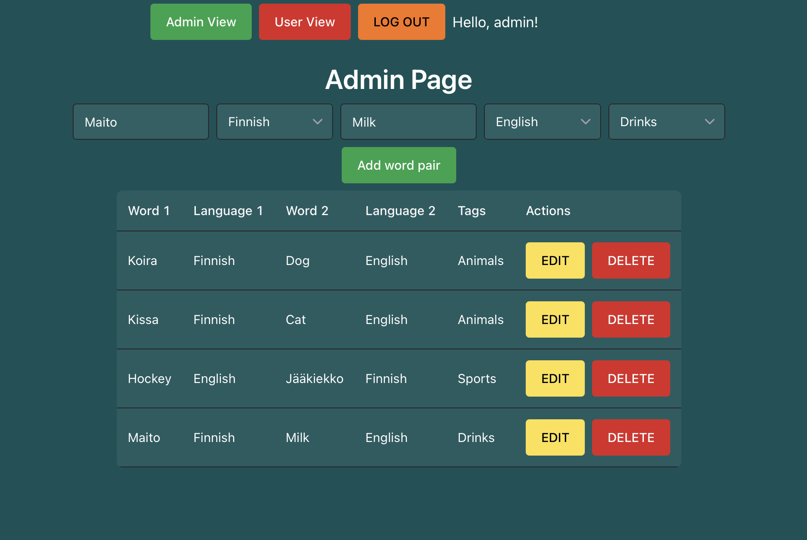
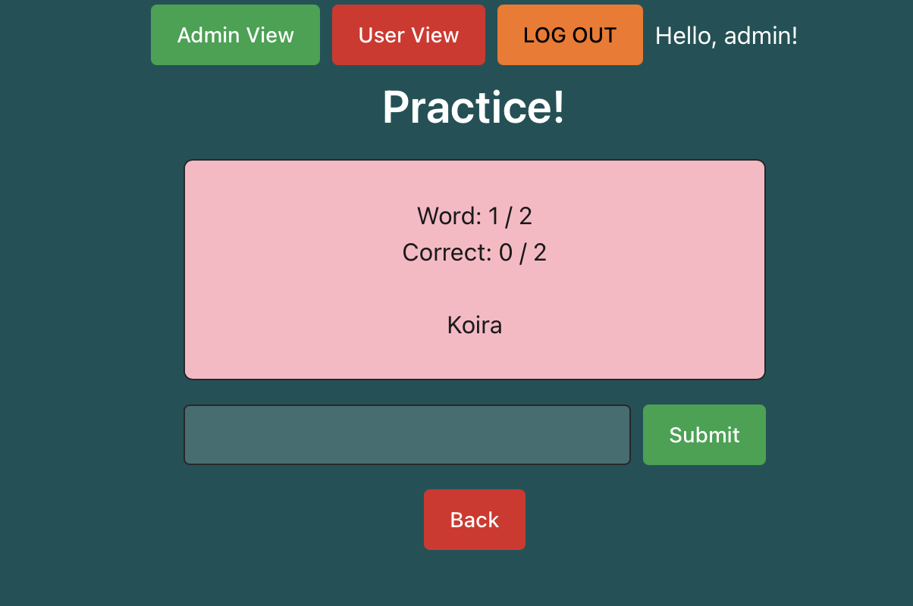
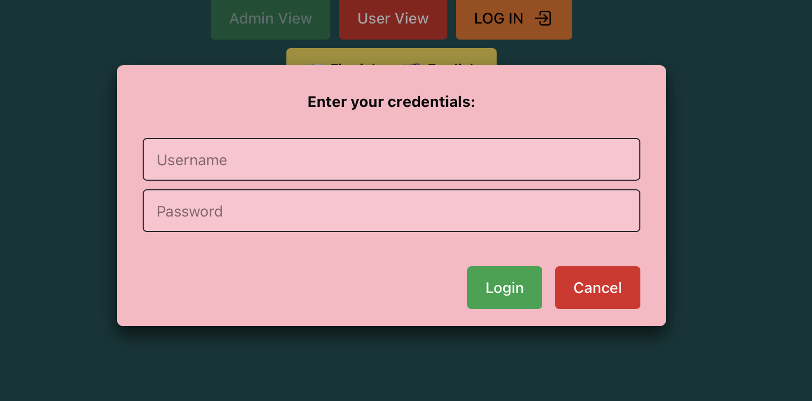

# Learn Languages! - Application for learning languages

This is a web application designed to help users learn new languages with simple flash cards. Application allows users to create their own flash cards, tags (groups) and manage them.

Live Demo: [https://learn-language-app.onrender.com](https://learn-language-app.onrender.com)
Screencast: [https://www.youtube.com/watch?v=53M1MOYtass](https://www.youtube.com/watch?v=53M1MOYtass)

## Table of Contents

1. [Tech stack](#tech-stack)
2. [Features](#features)
3. [How to run it](#how-to-run-it)
4. [Known Issues](#known-issues)
5. [Future Improvements](#future-improvements)
6. [API Documentation](#api-documentation)
7. [Screenshots](#screenshots)

## Tech stack

### Frontend

- React with TypeScript
- Vite + SWC for build tooling
- Chakra UI for styling and components

### Backend

- Node.js with Express server framework
- PostgreSQL for database management
- Docker for containerization
- Vitest and Supertest for testing

## Features

- Create, read, update and delete word pairs.
- Create, read and delete tags (groups).
- Admin users can manage all word pairs and tags, while regular users can only view them.
- Filter word pairs as a user by tags to practice on specific groups of words.
- Practice mode to test your knowledge of the word pairs.
- Wrong answer review after practice sessions to help you learn from your mistakes.
- Score tracking to keep track of your points in practice mode.

## How to run it

Pre-requisites:

- Node.js version 20 or higher and npm installed
- Docker installed and running

1. Clone the repository
2. From the project root, install dependencies:
```npm install```
3. Copy `.env.example` to `.env` in the backend directory and in the root directory and fill in the values with your own configurations.

4. Build and run the Docker containers:
```docker-compose up -d```
5. Initialize the database:
```npm run db:init --workspace=backend```
6. Seed the database with sample data:
```npm run db:insert --workspace=backend```
7. Start the application:
```npm run dev```
8. Open the application in your browser at [http://localhost:5173](http://localhost:5173) and start creating word pairs!

To access the admin view, log in with the credentials set in your `.env` file as `SEEDUSERPW`, username is `admin`.

## Known Issues

- No known issues right now.

## Future Improvements

- Implement frontend component testing
- Mobile responsiveness and design improvements for better user experience on different devices.
- Improve input validation when creating wordpairs and tags.
- Implement user registration and score tracking for individual users.
- Add more languages than original English and Finnish.
- Implement other game modes for practicing word pairs, such as connect the words or fill-in-the-blank.

## API Documentation

| Method | Endpoint | Description | Success Status Codes | Error Status Codes |
| --- | --- | --- | --- | --- |
| GET | /api/languages | Get all available languages | 200 OK | 500 Internal Server Error |
| GET | /api/words | Get all word pairs | 200 OK | 500 Internal Server Error |
| POST | /api/words | Create a new word pair | 201 Created | 400 Bad Request |
| PUT | /api/words/:id | Update a specific word pair | 200 OK | 400 Bad Request, 404 Not Found, 500 Internal Server Error |
| DELETE | /api/words/:id | Delete a specific word pair | 204 No Content | 404 Not Found, 500 Internal Server Error |
| GET | /api/tags | Get all tags | 200 OK | 500 Internal Server Error |
| POST | /api/tags | Create a new tag | 201 Created | 400 Bad Request |
| DELETE | /api/tags/:id | Delete a specific tag | 204 No Content | 404 Not Found, 500 Internal Server Error |
| POST | /api/words/:id/tags | Add a tag to a word pair | 201 Created | 400 Bad Request, 404 Not Found, 500 Internal Server Error |
| PUT | /api/words/:id/tags | Update tags for a word pair | 200 OK | 400 Bad Request, 404 Not Found, 500 Internal Server Error |
| POST | /api/auth/login | Login a user, sets session cookie | 200 OK | 400 Bad Request, 401 Unauthorized |
| POST | /api/auth/logout | Logout a user, destroys session cookie | 200 OK | 400 Bad Request, 401 Unauthorized |

### GET /api/languages - Example response body

```json
[
    {
        "id": 1,
        "name": "English"
    },
    {
        "id": 2,
        "name": "Finnish"
    }
]
```

### GET /api/words - Example response body

```json
[
    {
        "id": 1,
        "word1": "Dog",
        "language1": "English",
        "word2": "Koira",
        "language2": "Finnish",
        "tags": [
            {
                "id": 1,
                "name": "Animals"
            }
        ]
    },
    {
        "id": 2,
        "word1": "Cat",
        "language1": "English",
        "word2": "Kissa",
        "language2": "Finnish",
        "tags": []
    }
]
```

### POST /api/words - Example request body to create a new word pair

```json
{
  "word1": "Dog",
  "language1_id": 1,
  "word2": "Koira",
  "language2_id": 2
}
```

### POST /api/words - Example response body after creating a new word pair

```json
{
    "id": 1,
    "word1": "Dog",
    "language1": "English",
    "word2": "Koira",
    "language2": "Finnish"
}
```

### PUT /api/words/:id - Example request body to update a word pair

```json
{
  "word1": "Cat",
  "word2": "Kissa"
}
```

### PUT /api/words/:id - Example response body to update a word pair

```json
{
    "id": 1,
    "word1": "Cat",
    "language1": "English",
    "word2": "Kissa",
    "language2": "Finnish"
}
```

### GET /api/tags - Example response body

```json
[
    {
        "id": 1,
        "name": "Animals"
    },
    {
        "id": 2,
        "name": "Foods"
    }
]
```

### POST /api/tags - Example request body to create a new tag

```json
{
  "name": "Animals"
}
```

### POST /api/tags - Example response body after creating a new tag

```json
{
    "id": 1,
    "name": "Animals"
}
```

### POST /api/words/:id/tags - Example request body when assigning a tag to a word pair

```json
{
  "tagId": 6
}
```

### PUT /api/words/:id/tags - Example request body

```json
{
    "tagId": 1
}
```

### POST /api/auth/login - Example request body to login a user

```json
{
  "username": "admin",
  "password": "password123"
}
```

### POST /api/auth/logout - Example response body after successful logout

```json
{
    "message": "Logged out successfully"
}
```

## Screenshots


Admin view with word pairs

Practice mode view

Login view
